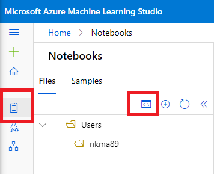
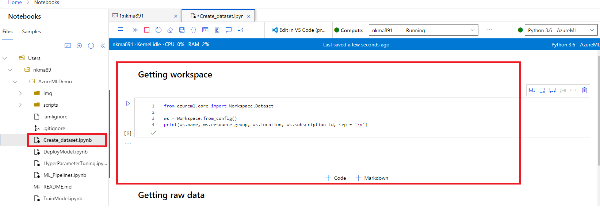

# Introduction 
This repository contains demo notebooks for using Azure Machine Learning Workspace. It covers the basic functionality of how to create datasets, train models, perform hyper parameter tuning, running ML pipelines and deploying models.

# Prerequisites
A few prerequisites needs to be in place before running the notebooks:
- Requires access to a working Azure Subscription. You can get a free trial here:
	- [Azure Free Trial](https://azure.microsoft.com/en-us/offers/ms-azr-0044p/)
- Create an Azure Machine Learning Workspace in Azure
    - [How to create AML Workspace](https://docs.microsoft.com/en-us/azure/machine-learning/quickstart-create-resources)
- Create a compute instance in the Azure ML Workspace
    - [How to create compute instance](https://docs.microsoft.com/en-us/azure/machine-learning/quickstart-create-resources#instance)

# Clone repository
Launch the studio and create the compute instance(If you haven't done that yet). Open the notebooks tab in azure ML workspace and click the terminal window. </br>

Clone this repository: 
```
git clone <repository-url>
```

# Authenticating in Azure ML
Initially the workspace will require you to authenticate. This is done automatically when running the notebook inside Azure ML Workspace and simply requires you to run the first cell:



NOTE: Running the notebooks locally will require you to authenticate against the workspace using one of the methods described here:
[Authentication in Azure ML](https://github.com/Azure/MachineLearningNotebooks/blob/master/how-to-use-azureml/manage-azureml-service/authentication-in-azureml/authentication-in-azureml.ipynb) </br>

# Running the notebooks
The notebooks shows examples of how to perform the basic steps in developing ML models.
The notebooks should be run in the following order:
1. Create_dataset
2. Train_model
3. Hyper_parameter_tuning(Optional)
4. ML_pipelines(Optional)
5. Deploy_model </br>

Enjoy using this awesome service! :)